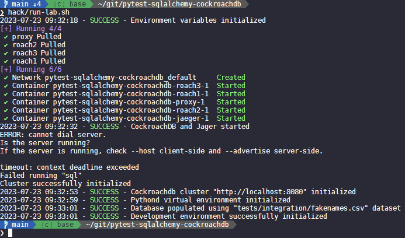

# Pytest SqlAlchemy CockroachDB

## TL&DR

```bash
hack/run-lab.sh
```



---

Create and customize the environment from the provided .

```bash
cp -v .env.example .env
```

Create the Python virtual environment.

```bash
python3 -m venv .venv
```

Activate the Python virtual environment.

```bash
source .venv/bin/activate
```

Install the Python dependencies.

```bash
pip3 install -r requirements.txt
```

Start the service stack composed of a **CockroachDB** cluster fronted by an **Envoy** proxy, and **Jaeger** tracing collector.

```bash
docker-compose up -d
```

Initialize the CockroachDB cluster.

```bash
docker-compose exec -it roach1 cockroach init --insecure
```

Run the pytest fixture.

```bash
pytest
```

Explorer the various consoles available after persistently populating the database.

```bash
python3 tests/populate_db.py --user root --password dummypassword
```

* **CockroachDB**: <http://localhost:8080>
* **Jaeger ui**: <http://localhost:16686>
* **Envoy admin**: <http://localhost:8081>